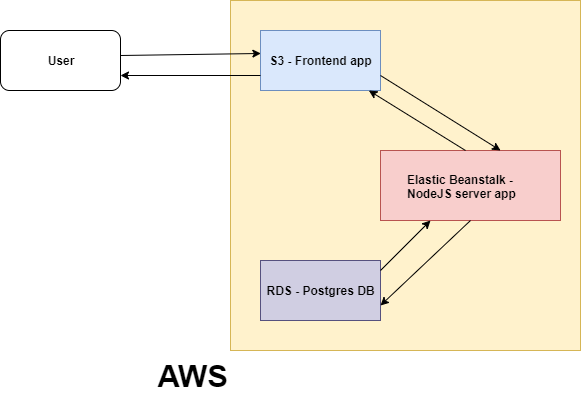

# INFRASTRUCTURE DESCRIPTION

Udagram is an app that uses AWS services:
S3, Elastic Beanstalk and RDS.

## AWS S3

AWS S3 hosts the frontend (static) files of the app

## AWS Elastic Beanstalk

Elastic Beanstalk is service that provides the NodeJS server

## AWS RDS

RDS hosts our Postgres DB

Check the image below, in order to see how these services interact each other.

